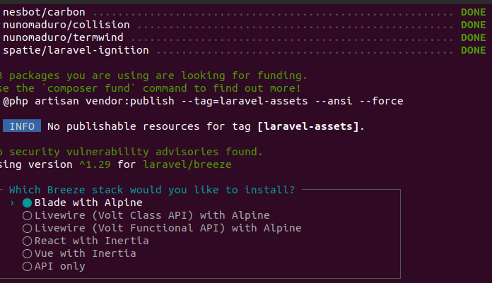
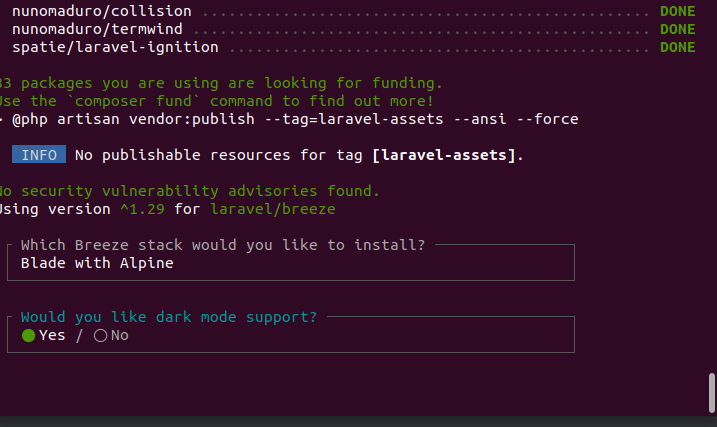
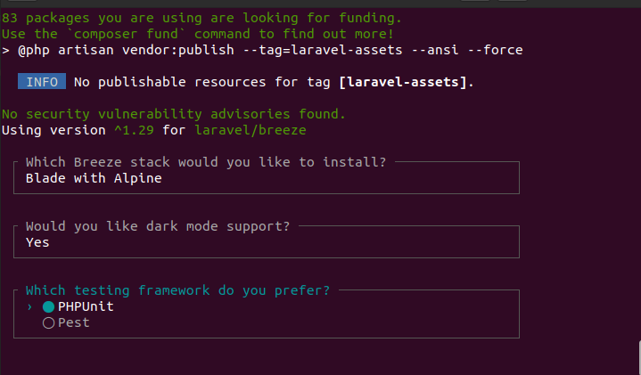
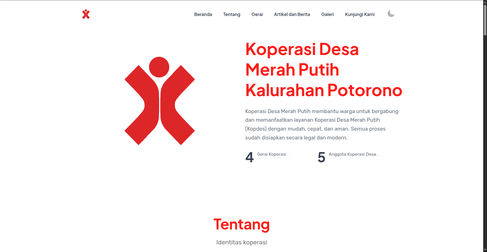
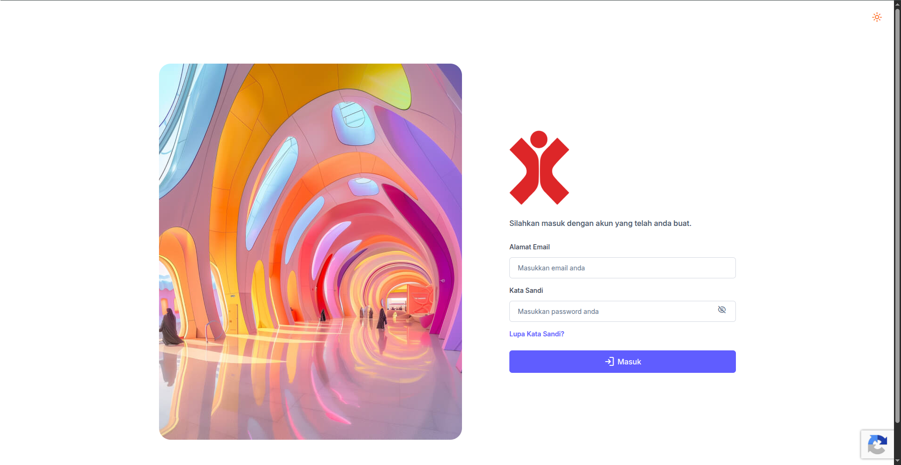
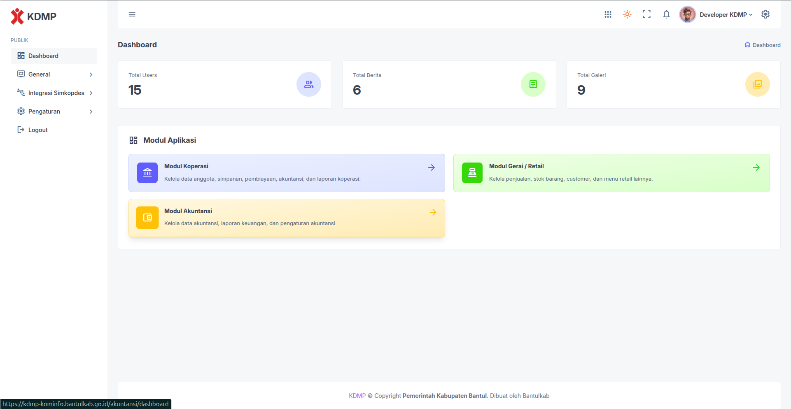

# Laravel Base Web App Installer

[TOC]

## Tested Laravel 12.*

## How to install

### For Linux & macOS

1. Open terminal
2. Run 

```shell
$ sh installer-laravel.sh
```

### For Windows

#### Option 1: Using Batch File (Easiest)
1. Navigate to the `installer` folder
2. Right-click on `windows-laravel-installer.bat`
3. Select **"Run as administrator"**
4. Follow the on-screen instructions

#### Option 2: Using PowerShell
1. Open **PowerShell as Administrator**
2. Navigate to the installer directory:
```powershell
cd path\to\kominfo-base-laravel-installer\installer
```
3. Run the installer:
```powershell
.\windows-laravel-installer.ps1
```

For detailed Windows installation instructions, see [Windows Installer README](installer/WINDOWS-INSTALLER-README.md)

### Installation Process

After running the installer:

```shell
$ choose your device OS is used
$ Insert project Laravel name: <input project name>
$ Insert project Laravel version: <input project version>
$ DB HOST: <input db host>
$ DB PORT: <input db port>
$ DB DATABASE: <input db database>
$ DB USERNAME: <input db username>
$ DB PASSWORD: <input db password>
```



Choose Blade with Alpine



Choose Yes



Choose PHPUnit

4. Wait until finish installing

5. If finish installing, you can delete folder installer here

6. Run Laravel

```shell
$ php artisan serve
```
7. For more information, i hope you can read README.md in yourprojcet/README.md


# About Template HTML
## Landing
Here in landing pages we use Template HTML From MARTEX (https://martex-tailwindcss.ibthemespro.com/index.html)



## Admin
Here in admin pages we use Template HTML From TREZO (https://trezo-twcss.envytheme.com/lms-index.html)

