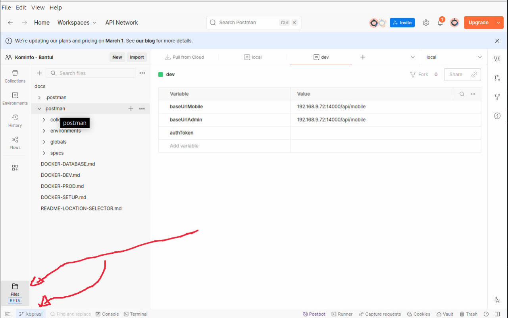
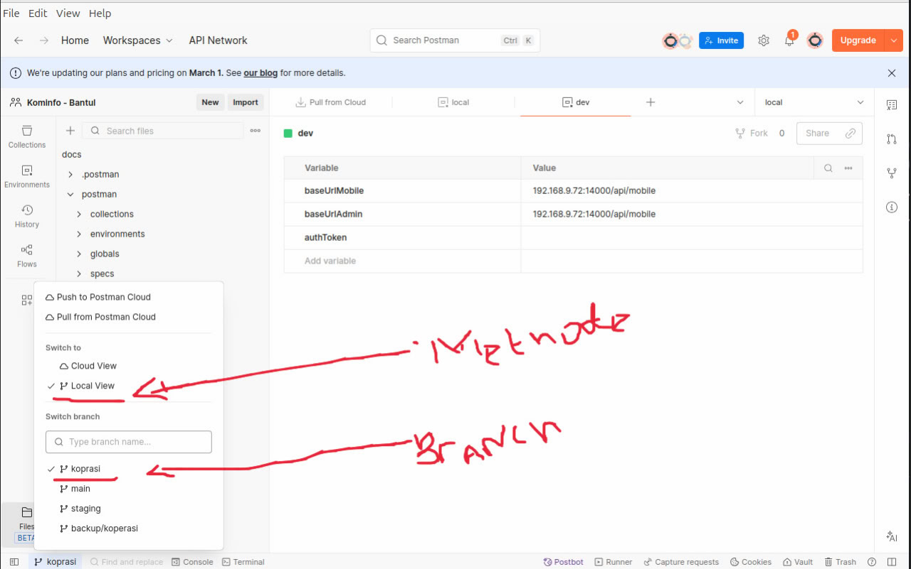

<p align="center"><a href="https://laravel.com" target="_blank"></a></p>

<p align="center">
<a href="https://travis-ci.org/laravel/framework"></a>
<a href="https://packagist.org/packages/laravel/framework"></a>
<a href="https://packagist.org/packages/laravel/framework"></a>
<a href="https://packagist.org/packages/laravel/framework"></a>
</p>

## Table Of Contents

[[_TOC_]]

## Requirements
- Laravel 12.x (PHP 8.2)
- NodeJS > 14
- Composer

## Template HTML is Used
- For Admin (Paces) : 
```
https://themes.coderthemes.com/paces/tailwind/index.html

```
- For Landing (Martex)
```
https://martex-tailwindcss.ibthemespro.com/index.html
```
IF you will edit Tailwind css for Landing Page you can edit file input css then you can : 
- Run npm run build-styling-landing. 
- then, you can copy file style.css in folder dist
- paste in public/assets/landing/css here

### Data Table is Used
- Data Tables Tailwind V 2.3.4
```
https://datatables.net/examples/styling/tailwind.html
```

## How to install

### Clone Repository
open your terminal, go to the directory that you will install this project, then run the following command:

```bash
git clone ...

cd base-laravel 
```

### Install packages
Install vendor using composer

```bash
composer update
```

Install node module using npm

```bash
npm install
```

### Configure .env
Copy .env.example file

```bash
cp .env.example .env
```

Then run the following command :

```php
php artisan key:generate
```

### Migrate Data
create an empty database with mysql 8.x version, then setup that fresh db at your .env file, then run the following command to generate all tables and seeding dummy data:

```php
php artisan migrate:fresh --seed
```
### Public Disk
To make these files accessible from the web, you should create a symbolic link from public/storage to storage/app/public.
To create the symbolic link, you may use the storage:link Artisan command:

```php
php artisan storage:link
```

### Running Application
To serve the laravel app, you need to run the following command in the project director (This will serve your app, and give you an adress with port number 8000 or etc)
- **Note: You need run the following command into new terminal tab**

```php
php artisan serve
```

Running vite
- **Note: You need run the following command into new terminal tab**

```bash
npm run dev
```

Access from public not found 404
```bash
sudo a2enmod rewrite
sudo service apache2 restart
AllowOverride All
```

## Email Test

MailHog is an email testing tool for developers.
- Inbox : 202.91.14.2:8025(http://202.91.14.2:8025)
- SMTP : 202.91.14.2:8125

## Integrate a Template
- Unzip in resource/template/name_template
- Add base css to resources/css/app.css
- Make main.js and add base js to resources/js/main.js (for production, see example)
- Make main-dev.js and add base js to resources/js/main-dev.js (for dev, see example)
- Edit vite.config.js

## API Documentation
### Using Postman Collection JSON

1. **Open the Postman application** on your computer.  
2. **Connect Postman to your local project folder**:  
   - Click the **Folder icon** at the bottom left of the Postman app.  
   - Select the `docs` folder inside this project as the location for the Postman documentation.  
   

3. **Verify the connection**:  
   - Make sure Postman is connected to **Local** storage, not to the **Cloud**.  
   

4. **Sync documentation changes with Git**:  
   - When you make changes to the API documentation or `collection.json`, commit and **push** them to the repository.  
   - To get the latest updates from the team, perform a **pull** from the repository.  

### Summary
- Documentation is stored in the `docs` folder.  
- Postman must be connected to **Local** to ensure changes are tracked in Git.  
- Use **push** to share updates and **pull** to receive the latest changes.  

---
